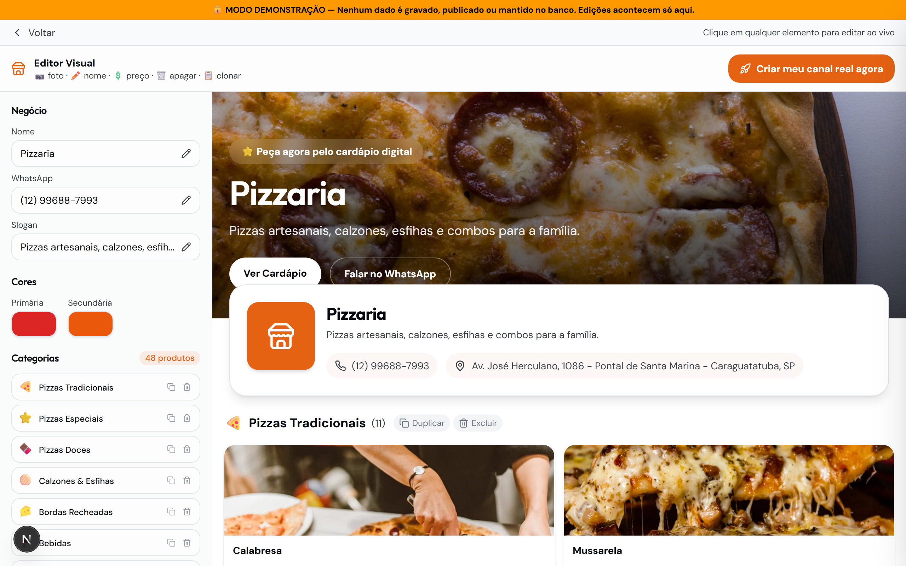
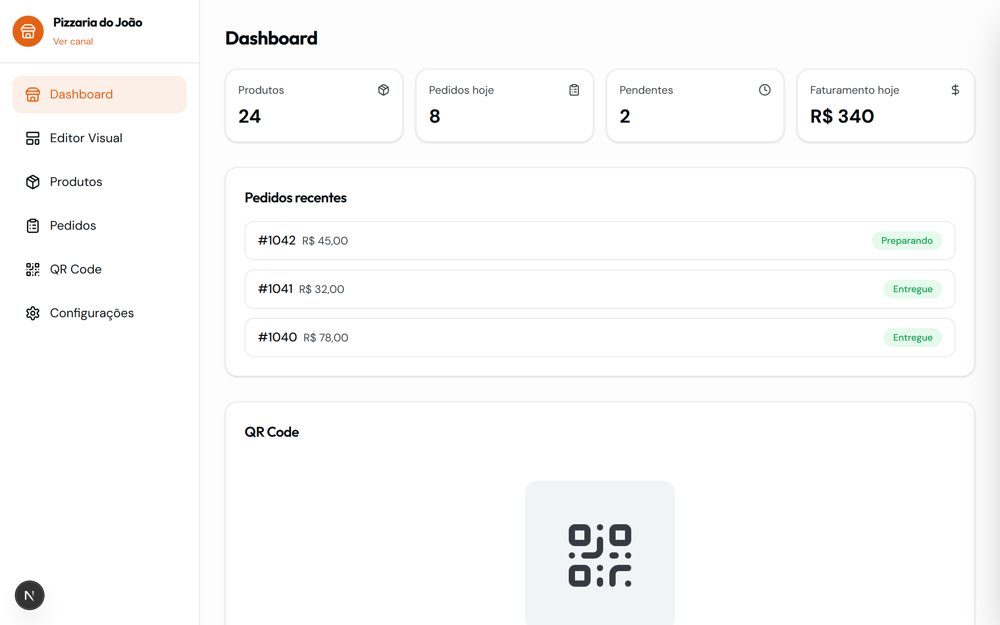

<div align="center">

# AI WhatsApp Menu System

**Automatize pedidos de restaurantes via WhatsApp com geração inteligente de mensagens e menos fricção no atendimento**

[](https://github.com/TiagoIA-UX/Cardapio-Digital/actions/workflows/ci.yml)
[](LICENSE)
[](https://www.zairyx.com.br)

[Demo ao Vivo](https://www.zairyx.com.br) · [Documentação](docs/) · [Contato](mailto:tiago@tiagoia.dev)

</div>

---

## O que é

> Solução pensada para transformar o WhatsApp no principal canal de vendas de restaurantes locais.

Zairyx é uma plataforma SaaS para deliverys, restaurantes e operações de food service que precisam transformar cardápio em pedido com menos cliques e mais conversão.

O cliente navega, monta o pedido, escolhe a forma de pagamento e segue para o WhatsApp já com a mensagem pronta. Para o operador, o sistema centraliza templates, painel, checkout, afiliados, suporte e automações.

**Demo ao vivo:** [https://www.zairyx.com.br](https://www.zairyx.com.br)

## Por que existe

## 🧠 Por que isso importa?

Restaurantes perdem pedidos por processos manuais e comunicação desorganizada.
Este sistema reduz a fricção do cliente e transforma o WhatsApp em um canal de conversão eficiente.

- Reduzir atrito no pedido via WhatsApp.
- Transformar cardápio em experiência de compra.
- Dar ao delivery uma operação digital pronta para escalar.
- Unificar pagamento, suporte, automação e gestão num só fluxo.

## 💰 Potencial de impacto

- Reduz o tempo de atendimento manual.
- Aumenta a conversão de pedidos.
- Elimina erros na comunicação com o cliente.

## Principais entregas

| Área             | O que entrega                                          |
| ---------------- | ------------------------------------------------------ |
| Cardápio digital | Templates por nicho com navegação otimizada para venda |
| WhatsApp         | Mensagem estruturada de pedido pronta para envio       |
| Checkout         | Mercado Pago com fluxo online e webhooks               |
| Operação         | Painel admin, suporte, afiliados e métricas            |
| IA e automação   | Assistência, alertas e rotinas de operação             |
| Infra            | Supabase, RLS, cron jobs, cache e observabilidade      |

## Stack

- Next.js 16 com App Router
- React 19, Tailwind CSS 4 e Radix UI
- TypeScript 5 em modo strict
- Supabase PostgreSQL + Auth
- Mercado Pago
- Cloudflare R2
- Upstash Redis
- GitHub Actions e Vercel

## Como funciona

1. O delivery escolhe o template.
2. Personaliza o visual e os produtos.
3. O cliente monta o pedido.
4. O sistema envia a mensagem para o WhatsApp ou processa o checkout.
5. O painel acompanha vendas, suporte e operações.

## 🔄 Fluxo da Automação

Cliente -> Seleciona itens -> Sistema gera pedido -> WhatsApp abre com mensagem pronta -> Envio ao delivery

## Prova visual

### Interface



### Painel operacional



### Resultado final


> Próximo upgrade visual recomendado: gravar um GIF curto com o fluxo escolher item -> montar pedido -> abrir WhatsApp.

## Repositório como produto

Este repositório não é só código. Ele representa um produto SaaS com foco em:

- conversão
- automação
- operação real para deliverys
- arquitetura preparada para escala

## Começar rápido

```bash
git clone https://github.com/TiagoIA-UX/Cardapio-Digital.git
cd Cardapio-Digital
npm install
npm run setup:local
npm run doctor
npm run dev
```

Abra [http://localhost:3000](http://localhost:3000).

## Scripts úteis

| Comando              | Descrição                      |
| -------------------- | ------------------------------ |
| `npm run dev`        | Servidor de desenvolvimento    |
| `npm run dev:https`  | Dev com HTTPS para integrações |
| `npm run doctor`     | Validação do ambiente          |
| `npm run audit:full` | Build + lint + testes          |
| `npm run ship:all`   | Pipeline completo de entrega   |

## Documentação

- [INSTALL.md](INSTALL.md)
- [SECURITY.md](SECURITY.md)
- [CONTRIBUTING.md](CONTRIBUTING.md)
- [docs/](docs/)

## Licença

Este projeto usa **Business Source License 1.1 (BSL)**.

- uso não comercial: permitido conforme os termos
- uso comercial: requer licença e autorização
- conversão automática para Apache 2.0 em 2030-03-19

Veja [LICENSE](LICENSE) e [docs/LICENCA_COMERCIAL_TEMPLATES.md](docs/LICENCA_COMERCIAL_TEMPLATES.md).

## Contato

- [tiago@tiagoia.dev](mailto:tiago@tiagoia.dev)
- [zairyx.com.br](https://www.zairyx.com.br)

---

<div align="center">

**Zairyx** © 2024-2026 Tiago Aureliano da Rocha

</div>
